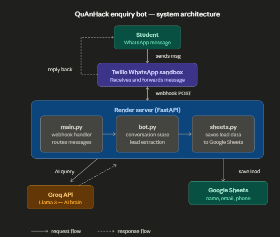

# 🎓Enquiry Bot

> AI-powered WhatsApp Enquiry Assistant for Educational Institutions  
> Built for the **QuAnHack Software Engineering & AI Internship — Final Round Challenge**

---

## 📌 Problem Statement

**Educational Institutions / Training Academies — Enquiry Assistant**

Handle student queries, share course details, capture and follow up with leads — all through WhatsApp.

---

## 🚀 Live Demo

- **Bot URL:** https://enquiry-bot-1.onrender.com  
- **WhatsApp:** Send a message to `+1 415 523 8886` (Twilio Sandbox)  
- **Join Code:** `join storm-company`

---

## 🧠 How It Works



```
Student (WhatsApp)
       ↓
Twilio WhatsApp Sandbox
       ↓
FastAPI Webhook (Render.com)
       ↓
bot.py — conversation state + lead extraction
       ↓
Groq API (Llama 3) — AI response generation
       ↓
Reply sent back → Student receives answer
       ↓ (if lead complete)
Google Sheets — lead saved with timestamp
```

---

## ✨ Features

- 💬 **Natural WhatsApp conversation** — students chat naturally, no commands needed
- 🤖 **AI-powered responses** — Groq (Llama 3) answers course queries intelligently
- 📚 **5 courses available** — Python, AI/ML, Web Dev, Data Science, Automation
- 📋 **Automatic lead capture** — extracts name, email, phone from conversation
- 📊 **Google Sheets integration** — saves every lead with timestamp automatically
- 🔄 **Session memory** — remembers conversation context per user
- 🌐 **Deployed on Render** — always live, no local server needed

---

## 🛠️ Tech Stack

| Layer | Technology | Purpose |
|---|---|---|
| AI Brain | Groq API (Llama 3.3-70b) | Generate smart responses |
| WhatsApp | Twilio Sandbox | Send/receive WhatsApp messages |
| Backend | FastAPI (Python) | Webhook server |
| Hosting | Render.com | Free cloud deployment |
| Lead Storage | Google Sheets API | Store captured leads |
| Auth | Google Service Account | Secure Sheets access |

---

## 📁 Project Structure

```
quanhack-enquiry-bot/
│
├── main.py              # FastAPI app + Twilio webhook
├── bot.py               # Conversation logic + lead extraction
├── groq_ai.py           # Groq API integration + system prompt
├── sheets.py            # Google Sheets lead saving
├── courses.py           # Course data + institute info
├── .env                 # API keys (not pushed to GitHub)
├── .gitignore           # Ignores .env and credentials
├── requirements.txt     # Python dependencies
└── README.md            # This file
```

---

## ⚙️ Setup & Installation

### 1. Clone the repository

```bash
git clone https://github.com/mmanikandan281/Enquiry-Bot.git
cd enquiry-bot
```

### 2. Create virtual environment

```bash
python -m venv venv
venv\Scripts\activate        # Windows
source venv/bin/activate     # Mac/Linux
```

### 3. Install dependencies

```bash
pip install -r requirements.txt
```

### 4. Set up environment variables

Create a `.env` file in the root folder:

```env
GROQ_API_KEY=your_groq_api_key
TWILIO_ACCOUNT_SID=your_twilio_account_sid
TWILIO_AUTH_TOKEN=your_twilio_auth_token
TWILIO_WHATSAPP_NUMBER=whatsapp:+14155238886
GOOGLE_SHEET_ID=your_google_sheet_id
GOOGLE_CREDENTIALS=your_credentials_json_content
```

### 5. Run locally

```bash
uvicorn main:app --reload
```

Server runs at: `http://127.0.0.1:8000`

---

## 🔑 API Keys Setup

### Groq API (Free)
1. Go to [console.groq.com](https://console.groq.com)
2. Sign up and create an API key
3. Free tier: unlimited requests

### Twilio WhatsApp Sandbox (Free)
1. Go to [twilio.com](https://twilio.com) and sign up
2. Go to Messaging → Try it out → Send a WhatsApp message
3. Copy Account SID and Auth Token from dashboard
4. Set webhook URL: `https://your-render-url.onrender.com/webhook`

### Google Sheets API
1. Go to [console.cloud.google.com](https://console.cloud.google.com)
2. Create project → Enable Sheets API + Drive API
3. Create Service Account → Download JSON key as `credentials.json`
4. Share your Google Sheet with the service account email

---

## 🚀 Deployment (Render.com)

1. Push code to GitHub
2. Go to [render.com](https://render.com) → New Web Service
3. Connect your GitHub repo
4. Set:
   - **Build Command:** `pip install -r requirements.txt`
   - **Start Command:** `uvicorn main:app --host 0.0.0.0 --port 10000`
5. Add all environment variables
6. Deploy!

---

## 💬 Sample Conversation

```
Student: Hi
Bot: 😊 Welcome to QuAnHack Academy! How can I help you today?

Student: What courses do you offer?
Bot: 📚 We have 5 courses:
     1. Python for Beginners
     2. AI & Machine Learning Fundamentals
     3. Web Development Bootcamp
     4. Data Science with Python
     5. Automation & AI Workflows
     Which one interests you?

Student: Tell me about AI ML
Bot: 🤖 AI & Machine Learning Fundamentals is 3 months, ₹9,999.
     Covers core AI/ML concepts, supervised & unsupervised learning,
     model building with scikit-learn. Basic Python required.
     Online Live classes, starts every 1st of the month.
     Would you like to enroll?

Student: Yes I want to enroll
Bot: 🎉 Great! Please share your full name, email and phone number.

Student: Manikandan, mani@gmail.com, 9876543210
Bot: ✅ Thank you Manikandan! You're enrolled in AI & ML course.
     We'll be in touch soon. Welcome to QuAnHack Academy!

[Lead automatically saved to Google Sheets]
```

---

## 📊 Lead Capture

Every enrolled student's details are automatically saved to Google Sheets:

| Timestamp | Name | Email | Phone | Status |

| 2026-05-02 12:22:29 | Manikandan | mani@gmail.com | 9876543210 | New Lead |

---

## 🏗️ Architecture

```
┌─────────────────────────────────────────────┐
│           Student (WhatsApp)                │
└──────────────┬──────────────────────────────┘
               │ sends message
┌──────────────▼──────────────────────────────┐
│         Twilio WhatsApp Sandbox             │
│         (+1 415 523 8886)                   │
└──────────────┬──────────────────────────────┘
               │ webhook POST
┌──────────────▼──────────────────────────────┐
│         FastAPI Server (Render.com)         │
│  ┌──────────┐ ┌──────────┐ ┌─────────────┐  │
│  │ main.py  │→│  bot.py  │→│  sheets.py  │  │
│  └──────────┘ └────┬─────┘ └──────┬──────┘  │
└───────────────────┬┘──────────────┼──────-──┘
                    │                │
         ┌──────────▼───┐   ┌────────▼──────┐
         │  Groq API    │   │ Google Sheets │
         │  (Llama 3)   │   │  (Leads DB)   │
         └──────────────┘   └───────────────┘
```

---

## 📦 Requirements

```
fastapi
uvicorn
groq
twilio
gspread
google-auth
python-dotenv
```

---

## 👨‍💻 Author

**Manikandan M**  
Final Round Submission — QuAnHack Software Engineering & AI Internship  
Built with Python, FastAPI, Groq AI, Twilio, and Google Sheets

---

## 📄 License

MIT License — feel free to use and modify.